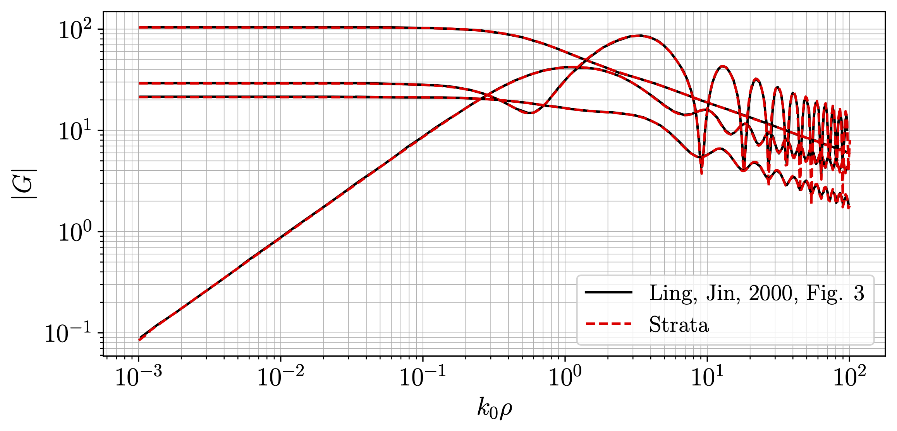

.. Author: Shashwat Sharma
.. Created on: Nov. 07, 2021

.. _build:

Building Strata
===============

.. _prereqs:

Prerequisites
-------------

* `CMake <https://cmake.org/>`_ version 3.10.2 or later

.. _install:

Installation
------------

To install Strata, clone `the Strata repository <https://github.com/modelics/strata>`_ and navigate to the root directory of the cloned repository in a terminal. Then run the following commands:

.. code-block:: bash

    mkdir build
    cd build
    cmake ..
    make

Important notes
"""""""""""""""

* An internet connection is required during the installation process because some third-party libraries (`OpenBLAS <https://www.openblas.net/>`_ and `yaml <https://github.com/jbeder/yaml-cpp>`_) will be downloaded automatically and installated locally in the directory ``build/external/builds``.
* If you already have OpenBLAS installed on your machine, you can save some time by reusing it. In that case, instead of ``cmake ..``, run

  .. code-block:: bash

      cmake -DWITH_OPENBLAS_INC=location/of/openblas/headers -DWITH_OPENBLAS_LIB=location/of/openblas/lib ..

  where ``location/of/openblas/headers`` is the path to the directory containing all OpenBLAS-related headers (e.g., ``cblas.h`` and ``lapacke.h``), and ``location/of/openblas/lib`` is the path to the directory containing the OpenBLAS shared library, usually ``libopenblas.so``.
* On macOS, the ``cmake`` command requires an additional option:

  .. code-block:: bash

      cmake -DCMAKE_INSTALL_RPATH_USE_LINK_PATH="ON" ..

Advanced users may want to consult `this <https://gitlab.kitware.com/cmake/community/-/wikis/FAQ#what-is-an-out-of-source-build>`_ for out-of-source builds.

To use Strata within your own application, include the directory ``inc``, which contains all the headers, and link to ``build/libstrata.so`` while building your project.

Strata is designed for UNIX-based operating systems, and has been tested on

* Ubuntu 20.04
* Ubuntu 18.04
* CentOS 7
* macOS Catalina 10.15.6

**Note**: the documentation is generated automatically during the build process.

Run your first test case
------------------------

A set of example layer definition files and test cases is provided in the ``test`` directory.
The most basic test case is in ``test/testMGF.cpp``, which takes as input the layer definition file (see ``doc/strata.html`` or ``doc/strata.pdf`` for details) and a name for the output file.
From within the ``build`` folder, run

.. code-block:: bash

    ./testMGF ../test/examples/ling_jin_2000/layers.yaml ../test/examples/ling_jin_2000/MGFdata.txt

This will compute the MGF for a simple example and store the reuslts in the file ``test/examples/ling_jin_2000/MGFdata.txt``.
Now, assuming you have Python 3 installed, you can plot the computed MGF:

.. code-block:: bash

    cd ../test/examples/ling_jin_2000
    python3 makeplots.py

You should see the following plot:

